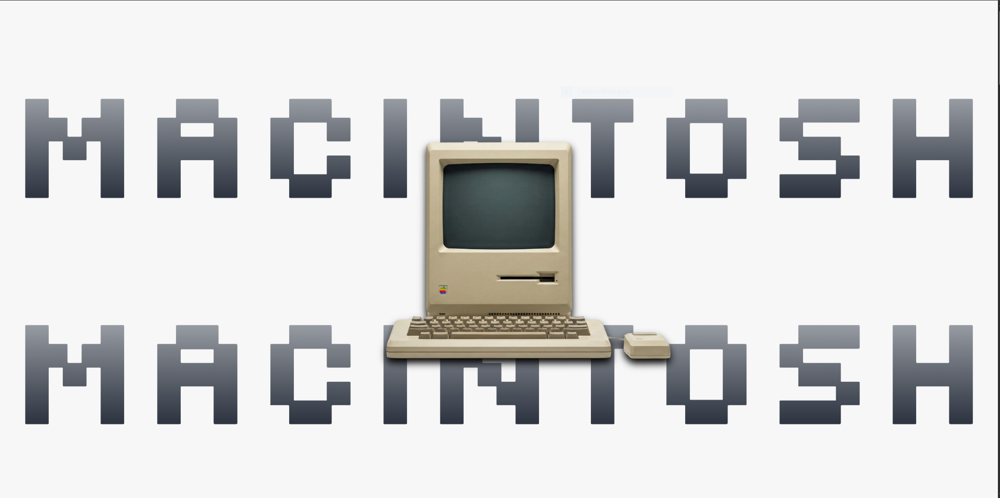

# 🖥️ Macintosh 128K Experience

<div align="center">


**A convergência entre o brutalismo digital de 1984 e a engenharia front-end moderna.**

[](https://macintosh-128k-experience.vercel.app)
[](https://nextjs.org/)
[](https://www.typescriptlang.org/)
[](https://gsap.com/)
[](https://www.framer.com/motion/)

</div>

---

## 📖 Visão Arquitetural e Conceito

O **Macintosh 128K Experience** é uma landing page conceitual e um portfólio imersivo que recria a estética revolucionária do primeiro Mac OS. Mais do que um exercício de nostalgia, o projeto é uma demonstração rigorosa de **Creative Coding**. Ele funde uma interface gráfica intencionalmente retro (pixel-perfect) com um motor de animações complexas impulsionado pelas ferramentas mais robustas do ecossistema front-end atual.

O objetivo técnico central foi orquestrar eventos de scroll complexos sem comprometer o *layout thrashing* ou a taxa de quadros (60fps), proporcionando uma experiência de "scroll-telling" fluida e cinematográfica.

## 🚀 Tecnologias e Paradigmas

A arquitetura foi projetada para lidar com renderizações visuais intensas enquanto mantém uma base de código modular e tipada:

- **[Next.js (App Router)](https://nextjs.org/):** Framework base, utilizado para otimizar o carregamento inicial (SSR/SSG) e estruturar componentes encapsulados.
- **[GSAP & ScrollTrigger](https://gsap.com/):** O núcleo da experiência. Utilizado para pinar elementos, orquestrar transições sequenciais complexas e manipular o DOM diretamente fora do ciclo de renderização do React para máxima performance.
- **[Framer Motion](https://www.framer.com/motion/):** Responsável por micro-interações de UI, gestos e animações baseadas em estados locais do React.
- **[Tailwind CSS](https://tailwindcss.com/):** Estilização customizada agressivamente para recriar as métricas de grid, tipografias bitmap e a paleta de cores monocromática/bege clássica dos anos 80.
- **[TypeScript](https://www.typescriptlang.org/):** Tipagem de ponta a ponta (97.3% da codebase) garantindo integridade de dados e previsibilidade nos Hooks de animação.

## ⚡ Engenharia de Animação e UX

O maior desafio em experiências guiadas por scroll é a performance e a consistência cross-device. As seguintes estratégias foram aplicadas:

1. **Orquestração Híbrida de Animação:** Separação clara de responsabilidades. GSAP lida com as mutações atreladas à física do scroll (paralaxe, pinning de seções), enquanto Framer Motion gerencia as transições de montagem/desmontagem de componentes de UI.
2. **Otimização de DOM (Hardware Acceleration):** O uso do GSAP assegura que animações sejam baseadas em `transform` e `opacity`, forçando a GPU a renderizar as camadas e evitando o recálculo custoso de layout e paint na main thread.
3. **Design System "Retro-Futurista":** Criação de um conjunto de tokens no Tailwind focados em replicar a UI clássica (bordas sólidas, sombras duras, tipografias sem anti-aliasing) mantendo a responsividade fluida para telas modernas.
4. **Integração de E-mail (Server Actions):** Implementação de rotas seguras utilizando `app/actions` e [Resend](https://resend.com/) para envio de formulários diretamente pelo servidor, sem a necessidade de APIs externas adicionais.

## 🧩 Estrutura do Projeto

```text
📦 Macintosh-128K-Experience
├── 📂 app/
│   ├── 📂 actions/           # Server Actions (ex: send-email.ts para o Resend)
│   ├── 📂 components/        # Componentes RRC (React Route Components)
│   │   ├── 📂 history/       # Core do Scroll-telling ("A Revolução")
│   │   ├── 📂 navbar/        # Réplica da Menu Bar do Mac OS clássico
│   │   └── 📂 specifications/# Layouts de apresentação técnica
│   ├── 📂 data/              # CMS estático / Camada de dados
│   │   └── 📜 manifesto.ts   # Textos e cópias do projeto
│   ├── 📜 layout.tsx         # Configurações de Viewport e Fontes globais
│   └── 📜 page.tsx           # Ponto de montagem da SPA
├── 📂 public/
│   ├── 📂 fonts/             # Tipografias retro hospedadas localmente
│   └── 📂 images/            # Assets otimizados
├── 📜 tailwind.config.ts     # Tema retro-customizado
└── 📜 tsconfig.json          # Configuração estrita do TS
````

## ⚙️ Instalação e Execução Local

### Pré-requisitos

  - [Node.js](https://nodejs.org/) (v18+)

### Setup Local

1.  Clone o repositório:

<!-- end list -->

```bash
git clone [https://github.com/victor-kiss/Macintosh-128K-Experience.git](https://github.com/victor-kiss/Macintosh-128K-Experience.git)
cd Macintosh-128K-Experience
```

2.  Instale as dependências:

<!-- end list -->

```bash
npm install
```

3.  (Opcional) Configure as variáveis de ambiente. Crie um `.env.local`:

<!-- end list -->

```env
RESEND_API_KEY=sua_chave_api_aqui
```

4.  Execute o ambiente de desenvolvimento:

<!-- end list -->

```bash
npm run dev
```

Acesse [http://localhost:3000](https://www.google.com/search?q=http://localhost:3000) para visualizar.

## 👨‍💻 Autor e Créditos

Desenvolvido por **Victor Kiss**.  
Uma homenagem técnica e criativa à engenharia e design de 1984.

[](https://www.google.com/search?q=https://www.linkedin.com/in/victor-kiss/)
[](https://www.google.com/search?q=https://github.com/victor-kiss)

*"O Macintosh 128K não é apenas um computador; é o grito da liberdade. Pare de marchar na linha. Comece a criar o seu próprio caminho."*
**💖 Feito com `npm run dev` e muita nostalgia.**
